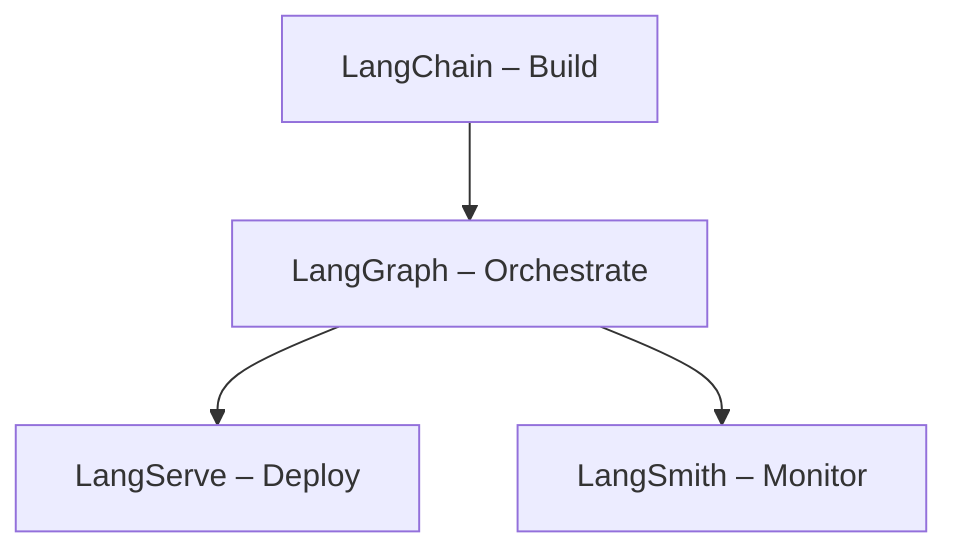

# LangChain Explained

## LangChain Family of Tools

The LangChain ecosystem is a comprehensive suite of frameworks and tools designed for building production-ready AI applications powered by large language models (LLMs). This family of tools simplifies every stage of the LLM application lifecycle – from development and testing to deployment and monitoring. Each component serves a specific purpose while working seamlessly together to ensure optimal performance and maintainability.

## Core LangChain Family Components

### **LangChain** 
- **What it is**: The main framework for building AI applications
- **Purpose**: Connect language models to external data and systems
- **Key features**: 
  - Chain different AI operations together
  - Memory management
  - Tool integration
  - Prompt templates
- **When to use**:
  - Building basic AI applications
  - Connecting LLMs to data sources
  - Creating simple chains of operations

### **LangGraph** 
- **What it is**: Framework for building stateful, multi-actor applications
- **Purpose**: Create complex workflows with multiple AI agents
- **Key features**:
  - Graph-based workflow design
  - State management between steps
  - Conditional branching
  - Multi-agent coordination
- **When to use**:
  - Need complex multi-step workflows
  - Building multi-agent systems
  - Require conditional logic and branching

### **LangServe** 
- **What it is**: Deployment framework for LangChain applications
- **Purpose**: Turn your AI apps into web APIs easily
- **Key features**:
  - REST API creation
  - Automatic documentation
  - Streaming support
  - Easy deployment
- **When to use**:
  - Want to deploy your app as an API
  - Need to serve multiple users
  - Building production applications

### **LangSmith** 
- **What it is**: Platform for debugging, testing, and monitoring AI apps
- **Purpose**: Track and improve your AI application performance
- **Key features**:
  - Trace execution steps
  - Performance monitoring
  - A/B testing
  - Error debugging
- **When to use**:
  - Debugging application issues
  - Monitoring production performance
  - Testing different approaches

### **LangChain Expression Language (LCEL)** 
- **What it is**: Declarative way to compose chains
- **Purpose**: Build complex AI workflows with simple syntax
- **Key features**:
  - Pipe operations together
  - Parallel execution
  - Streaming support
  - Easy debugging

## How They Work Together

1. **Build** with LangChain: Create your AI application
2. **Orchestrate** with LangGraph: Design complex workflows
3. **Deploy** with LangServe: Make it accessible via API
4. **Monitor** with LangSmith: Track performance and debug

